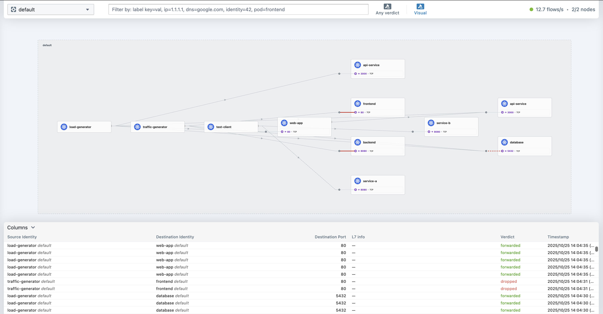

# Cilium Examples & Demos

A comprehensive collection of Cilium examples demonstrating network policies, service mesh capabilities, and observability features in Kubernetes.

## 🚀 What is Cilium?

Cilium is a networking, observability, and security solution with an eBPF-based data plane. It provides:

- **Network Policies**: Micro-segmentation and zero-trust networking
- **Service Mesh**: Traffic management, load balancing, and security
- **Observability**: Real-time network flow visibility with Hubble
- **Security**: mTLS, identity-based access control, and threat detection

## 📁 Repository Structure

```
cilium-examples/
├── use-case-1/          # Network Policies & Micro-segmentation
├── use-case-2/          # Hubble Observability & Network Flows
├── use-case-3/          # Service Mesh & Traffic Management
└── README.md           # This file
```

## 🎯 Use Cases

### [Use Case 1: Network Policies & Micro-segmentation](cilium-examples/use-case-1/)
**Zero-trust networking with fine-grained access control**

- **L4 & L7 Network Policies**: Port and HTTP path-based access control
- **Micro-segmentation**: Frontend → Backend → Database communication
- **Zero-trust Model**: Default deny with explicit allow rules
- **L7 Testing**: HTTP path and method-based policies

**Key Features:**
- CiliumNetworkPolicy with HTTP rules
- Path-based access control (`/health`, `/api/*`)
- Method-based restrictions (GET, POST, etc.)
- Comprehensive L7 testing commands

### [Use Case 2: Hubble Observability](cilium-examples/use-case-2/)
**Real-time network flow visibility and monitoring**

- **Network Flow Visualization**: Live traffic patterns and service communication
- **Security Monitoring**: Policy violations and blocked connections
- **Performance Analysis**: Traffic rates, latency, and throughput
- **Troubleshooting**: Flow-by-flow analysis with timestamps

**Key Features:**
- Hubble UI with visual network topology
- Real-time flow monitoring (12.7 flows/s)
- Service dependency mapping
- Security event tracking

### [Use Case 3: Service Mesh & Traffic Management](cilium-examples/use-case-3/)
**Advanced traffic management with Cilium Service Mesh**

- **Canary Deployments**: 90% v1, 10% v2 traffic splitting
- **Load Balancing**: Round-robin distribution across replicas
- **Circuit Breaker**: Automatic failover when services fail
- **mTLS Security**: Automatic service-to-service encryption
- **Retry & Timeout Policies**: Resilient service communication

**Key Features:**
- CiliumTrafficPolicy CRD for advanced traffic control
- Automatic mTLS encryption
- Circuit breaker pattern implementation
- Service mesh observability

## 🛠️ Quick Start

### Prerequisites

- Kubernetes cluster (minikube, kind, or cloud)
- kubectl configured
- Cilium installed (see [CILIUM-SETUP.md](CILIUM-SETUP.md))

### Installation

1. **Install Cilium**:
   ```bash
   # Follow the setup guide
   cat CILIUM-SETUP.md
   ```

2. **Deploy a Use Case**:
   ```bash
   # Example: Use Case 1
   cd cilium-examples/use-case-1
   kubectl apply -f 01-frontend-deployment.yaml
   kubectl apply -f 02-backend-deployment.yaml
   kubectl apply -f 03-database-deployment.yaml
   kubectl apply -f 04-services.yaml
   kubectl apply -f 05-network-policies.yaml
   ```

3. **Test the Setup**:
   ```bash
   # Test network policies
   kubectl exec -it deployment/frontend -- curl http://backend-service:8080/health
   
   # View in Hubble UI
   kubectl port-forward -n kube-system svc/hubble-ui 8080:80
   open http://localhost:8080
   ```

## 📊 Features Demonstrated

### ✅ **Network Security**
- **Micro-segmentation**: Tier-based access control
- **Zero-trust networking**: Default deny policies
- **L7 HTTP policies**: Path and method-based access
- **Identity-based security**: Pod identity enforcement

### ✅ **Service Mesh**
- **Traffic splitting**: Canary deployments
- **Load balancing**: Multiple algorithms
- **Circuit breaking**: Fault tolerance
- **mTLS encryption**: Automatic service-to-service security
- **Retry policies**: Resilient communication

### ✅ **Observability**
- **Real-time flows**: Live network traffic
- **Service topology**: Visual network maps
- **Security events**: Policy violations
- **Performance metrics**: Latency and throughput
- **L7 information**: HTTP method, path, status

### ✅ **Advanced Features**
- **Custom CRDs**: CiliumTrafficPolicy
- **eBPF-based**: High-performance networking
- **Kubernetes native**: Standard K8s resources
- **Cloud agnostic**: Works on any K8s cluster

## 🔧 Tools & Commands

### **Testing Scripts**
- **mTLS Verification**: `./test-mtls.sh`
- **L7 Testing**: See individual use case guides
- **Network Policies**: Comprehensive testing commands

### **Observability**
- **Hubble UI**: `kubectl port-forward -n kube-system svc/hubble-ui 8080:80`
- **Hubble API**: `curl http://localhost:4245/api/v1/flows`
- **Cilium CLI**: `cilium status`, `cilium hubble observe`

### **Troubleshooting**
- **Policy Debugging**: `cilium policy get`
- **Flow Analysis**: `cilium hubble observe --follow`
- **Service Mesh**: `cilium service list`

## 📚 Documentation

- **[Cilium Setup Guide](CILIUM-SETUP.md)**: Installation and configuration
- **[Hubble UI Guide](HUBBLE-UI-GUIDE.md)**: Detailed UI analysis and usage
- **[Cilium vs AWS VPC CNI](cilium-vs-aws-vpc-cni-comparison.md)**: Feature comparison
- **[L7 Testing Commands](cilium-examples/use-case-1/06-l7-testing-commands.md)**: HTTP policy testing

## 🎨 Screenshots



*Real-time network flow visualization in Hubble UI showing service communication patterns, security enforcement, and performance metrics.*

## 🤝 Contributing

1. Fork the repository
2. Create a feature branch
3. Add your examples or improvements
4. Test thoroughly
5. Submit a pull request

## 📄 License

This project is licensed under the MIT License - see the [LICENSE](LICENSE) file for details.

## 🔗 Useful Links

- [Cilium Documentation](https://docs.cilium.io/)
- [Cilium GitHub](https://github.com/cilium/cilium)
- [Hubble Documentation](https://docs.cilium.io/en/stable/observability/hubble/)
- [eBPF Documentation](https://ebpf.io/)

## 🆘 Support

- **Issues**: Create a GitHub issue for bugs or questions
- **Discussions**: Use GitHub Discussions for general questions
- **Community**: Join the [Cilium Slack](https://cilium.herokuapp.com/)

---

**Built with ❤️ for the Cilium community**
